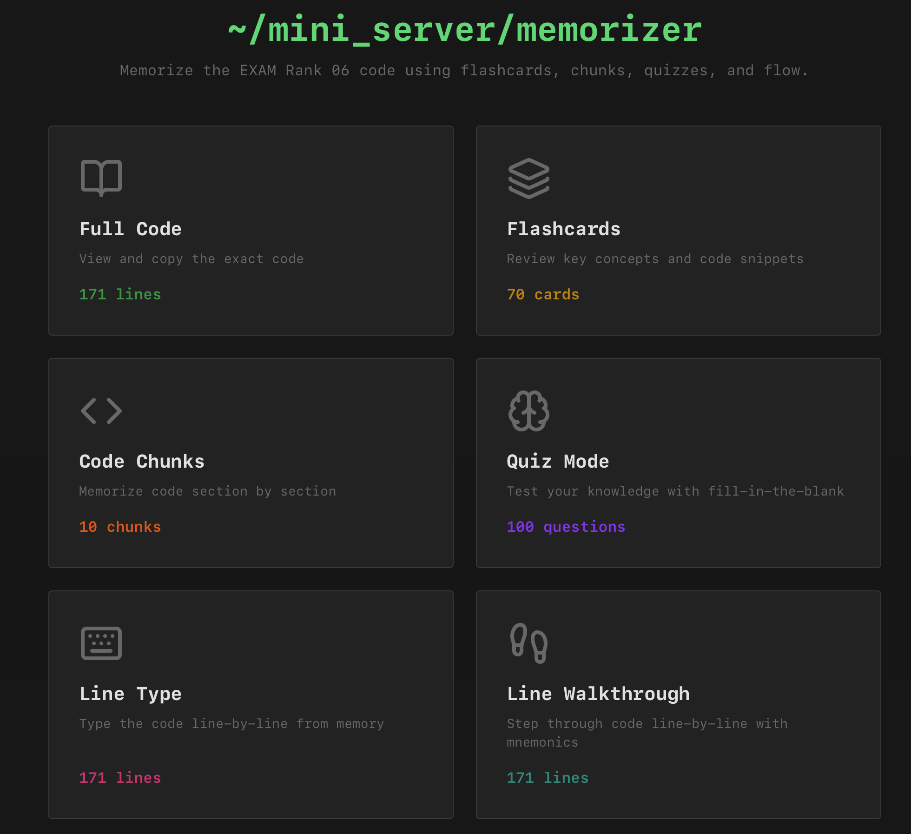

# Mini Server Memorizer

## What's inside?

This interactive learning tool provides multiple study modes to help you master the mini-serv (EXAM Rank_06) implementation. The application includes several features designed to reinforce your understanding through different learning approaches:

###Flashcards### offer a classic spaced-repetition learning experience where you can flip through cards containing key concepts, function signatures, and implementation details. Each card presents a question or concept on one side and the answer or explanation on the reverse, allowing you to test your recall before revealing the solution.

###Quiz Mode### provides an interactive testing environment where you can evaluate your knowledge through multiple-choice questions, code completion exercises, and scenario-based problems. The quiz tracks your progress and highlights areas that need more attention, helping you identify weak spots in your understanding.

###Code Reference### sections present organized, searchable snippets of the mini-serv implementation, allowing you to quickly look up specific functions, error handling patterns, and networking concepts. This serves as a quick reference guide when you need to refresh your memory on particular implementation details.

###Code Chunks### break down the complete mini-serv implementation into digestible, logical sections. Each chunk focuses on a specific aspect of the server—from socket creation and binding to request handling and response generation. This modular approach helps you understand how different parts of the code work together and makes it easier to memorize the overall structure.

###Line-by-Line Coding### guides provide detailed walkthroughs of critical code sections with annotations explaining what each line does and why it's necessary. These explanations cover variable declarations, system calls, error checks, and control flow, helping you understand not just what the code does, but the reasoning behind each implementation choice.

The application uses a clean, dark-themed interface optimized for extended study sessions, with syntax highlighting and clear visual organization to make code easy to read and understand. All content is available online, making it perfect for studying anywhere.

## Purpose

This project is designed for **educational purposes** to help understand the implementation of mini-serv. It serves as a learning tool for students preparing for exams.

## ⚠️ Important Notice

**This solution is NOT 100% tested and may contain errors.**

Students should:
- Review and verify the code thoroughly
- Test the implementation themselves
- Check for potential issues before relying on it for exams
- Use this as a reference, not as a final solution

This is a study aid to help with understanding the concepts, but it should not be considered a complete or error-free implementation.

## Usage

**Live Demo:** [https://vkatasonov.github.io/Mini_Server_Memorizer/](https://vkatasonov.github.io/Mini_Server_Memorizer/)
